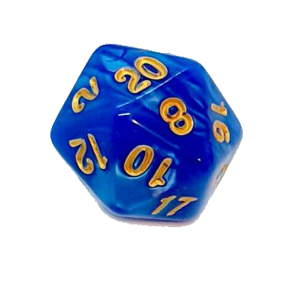
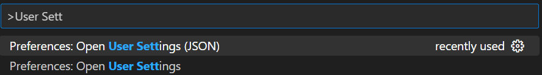

# 1 Arrays

Die wohl wichtigste Datenstruktur ist das Array. Zum Start wollen wir noch einmal die Grundlagen auffrischen, bevor wir uns weiteren interessanten Strukturen zuwenden.

## Problem 1: Fehlerhaften Quelltext korrigieren

**Problem**: Ein Freund hat ein Programm geschrieben, das eine Reihe von Messwerten einlesen und daraus einen Wert berechnen soll. Das Programm kompiliert, jedoch ist das Ergebnis unerwartet.

**Auftrag**: Beschäftigt euch allein oder zu zweit den Quelltext und löst die folgenden Fragen:

1. Notiert alle Fehler, die euch auffallen und wie ihr diese am sinnvollsten korrigieren würdet. Korrigiert den Quelltext in VSCode!
2. Hätte das Programm syntaktische Fehler, würde der Compiler bereits beim Kompilieren meckern und den Prozess abbrechen. Welche Art von Fehlern sind in diesem Quelltext versteckt? Grenzt diese Art von syntaktischen Fehlern ab.
3. Macht euch noch einmal damit vertraut, wie man Speicher für einen Array allokiert, auf dessen Elemente zugreift und wie man mit den Grenzen umgeht.
4. Notiert euch **ungeklärte Fragen** für die **Besprechung**

**Besprechung**: Der Würfel entscheidet, wer präsentiert!

**Besprechung**: Der Würfel entscheidet, wer präsentiert!

```cpp
#include <iostream>

double doMathMagic(double[]);

int main()
{
    double messwerte[5];
    std::cout << "Bitte geben Sie ihre Messwerte ein" << std::endl;
    for (int i = 0; i < 10; i++)
    {
        std::cout << "Wert " << i + 1 << std::endl;
        std::cin >> messwerte[i];
    }
    std::cout << "Eingegebene Werte:";
    for (int i = 0; i < 10; i++)
    {
        std::cout << "Eingelesener Wert " << i + 1 << "= " << messwerte[i] << std::endl;
    }
    int mitt = doMathMagic(messwerte);
    std::cout << "Der Mittelwert betraegt " << mitt;
    return 0;
}

double doMathMagic(double arr[])
{
    int i = 0;
    double erg = 0;
    int laenge = sizeof(arr) / sizeof(double);
    while (i < laenge)
    {
        erg = erg + arr[i];
        i++;
    }
    erg = erg / laenge;
    return erg;
}
```

## Problem 2: Ein Array sortieren

**Problem**: Im folgenden soll ein Sortierverfahren implementiert werden. Versucht euch selbst davon abzuhalten, einfach Code aus dem Internet zu kopieren! Gegeben ist folgendes Problem:

Ein Array mit Zahlenwerten z. B. ` [1, 5, 6, 3, 4]` soll der Größe nach aufsteigend geordnet werden. Entwickelt **auf dem Papier** einen Algorithmus, mit dem ihr zuverlässig das Array sortieren könnt.

todo

Rechenkomplexität versus Speicherkomplexität sinnvoll reinbringen (ohne Landau-Symbole usw.)

## Problem 3: Einen Algorithmus entwickeln, um in einem sortierten Array einen Wert zu finden

todo

## Problem 4: Einem Array einen weiteren Wert hinten|vorne anhängen.

Inline Math $$ a + b + c = 5 $$ asdfds $\LaTeX$ asdfsdf

$$
\sqrt{\pi}{3} \cdot \Delta x
$$
